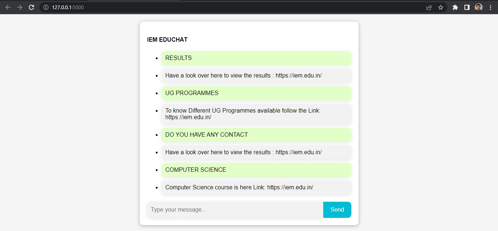

<br/>
<p align="center">
  <a href="https://github.com/Sayantan135/Chatbot-using-AIML">
    
  </a>

  <h3 align="center">An academic-based chatbot where you can extract information about a particular sections like result, department, course, library as well as info about faculty, etc</h3>

  <p align="center">
    Let's chat!
    <br/>
    <br/>
    <a href="https://github.com/Sayantan135/Chatbot-using-AIML"><strong>Explore the docs »</strong></a>
    <br/>
    <br/>
    <a href="https://github.com/Sayantan135/Chatbot-using-AIML">View Demo</a>
    .
    <a href="https://github.com/Sayantan135/Chatbot-using-AIML/issues">Report Bug</a>
    .
    <a href="https://github.com/Sayantan135/Chatbot-using-AIML/issues">Request Feature</a>
  </p>
</p>

      

## Table Of Contents

* [About the Project](#about-the-project)
* [Built With](#built-with)
* [Getting Started](#getting-started)
  * [Prerequisites](#prerequisites)
  * [Installation](#installation)
* [Usage](#usage)
* [Roadmap](#roadmap)
* [Contributing](#contributing)
* [License](#license)
* [Authors](#authors)
* [Acknowledgements](#acknowledgements)

## About The Project



This is the user interface of this chatbot appliaction as you can see you write command the chatbot it gives us required results. 

Th features of this chatbot are:

* Very easy to use
* All at one place
* You don't need need to surf all over the institute website to find the 


A list of commonly used resources that I find helpful are listed in the acknowledgements.

## Built With

This project is built using the Flask and AIML (Artificial Intelligence Markup Language) along with HTML and CSS in the frontend

## Getting Started

Follow this steps to set up the project locally in your device.

### Prerequisites

This is an example of how to list things you need to use the software and how to install them.

* Flask

```sh
pip install Flask
```

### Installation

1. Clone the repo

```sh
git clone https://github.com/Sayantan135/Chatbot-using-AIML.git
```

3. Run the app.py file

```sh
python app.py
```


## Usage

Use this space to show useful examples of how a project can be used. Additional screenshots, code examples and demos work well in this space. You may also link to more resources.

_For more examples, please refer to the [Documentation](https://example.com)_

## Roadmap

See the [open issues](https://github.com/Sayantan135/Chatbot-using-AIML/issues) for a list of proposed features (and known issues).

## Contributing

Contributions are what make the open source community such an amazing place to be learn, inspire, and create. Any contributions you make are **greatly appreciated**.
* If you have suggestions for adding or removing projects, feel free to [open an issue](https://github.com/Sayantan135/Chatbot-using-AIML/issues/new) to discuss it, or directly create a pull request after you edit the *README.md* file with necessary changes.
* Please make sure you check your spelling and grammar.
* Create individual PR for each suggestion.
* Please also read through the [Code Of Conduct](https://github.com/Sayantan135/Chatbot-using-AIML/blob/main/CODE_OF_CONDUCT.md) before posting your first idea as well.

### Creating A Pull Request

1. Fork the Project
2. Create your Feature Branch (`git checkout -b feature/AmazingFeature`)
3. Commit your Changes (`git commit -m 'Add some AmazingFeature'`)
4. Push to the Branch (`git push origin feature/AmazingFeature`)
5. Open a Pull Request

## License

Distributed under the MIT License. See [LICENSE](https://github.com/Sayantan135/Chatbot-using-AIML/blob/main/LICENSE.md) for more information.

## Authors

* **Sayantan Pal** - *Computer Science Engineering student* - [Sayantan Pal](https://github.com/sayantan135) - *Project Admin*
* **Subhedeep Tewary** - *Computer Science Engineering student* - [Subhedeep Tewary](https://github.com/SubhadeepTewary) - *Frontend*
* **Abhishek Raut** - *Computer Science Engineering student* - [Abhishek Raut](https://github.com/abhishek10200) - *Backend*
* **Souparna Das** - *Computer Science Engineering student* - [Souparna Das](https://github.com/souparnadas) - *Backend*

## Acknowledgements

* [Sayantan Pal](https://github.com/sayantan135/)
* [Shubhadeep Tewary](https://github.com/SubhadeepTewary)
* [Abhishek Raut](https://github.com/abhishek10200/)
* [Souparna Das](https://github.com/souparnadas)
